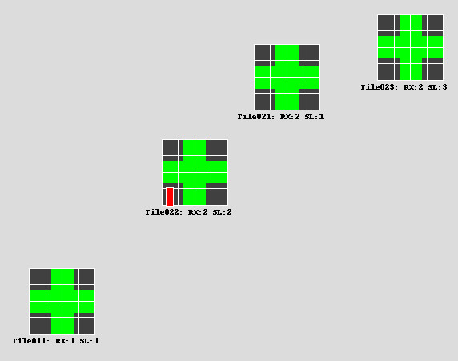

# Dead dipoles

Each MWA tile has 16 "bowties", and each bowtie is made up of two dipoles (one
X, one Y). We refer to a "dead" dipole as one that is not functioning correctly
(hopefully not receiving any power at all). This information is used in
generating beam responses as part of modelling visibilities. The more accurate
the visibilities, the better that calibration performs, so it is important to
account for dead dipoles if possible.

Beam responses are generated with
[`hyperbeam`](https://github.com/MWATelescope/mwa_hyperbeam) and dead dipole
information is encoded as a "dipole gain" of 1 ("alive") or 0 ("dead"). It is
possible to supply other values for dipole gains, although at the time of
writing `hyperdrive` only uses ones or zeros.

For the relevant functions, dead dipole information can be ignored by supplying
a flag `--unity-dipole-gains`. This sets all dipole gains to 1.

At the time of writing, dead dipole information is *only* supplied by a
[metafits file](metafits.md).

See [this
page](https://wiki.mwatelescope.org/pages/viewpage.action?pageId=48005139) for
more info on dipole ordering.

In the image below, you can see the 12th Y dipole is dead for "Tile022". All
other dipoles are "alive".

