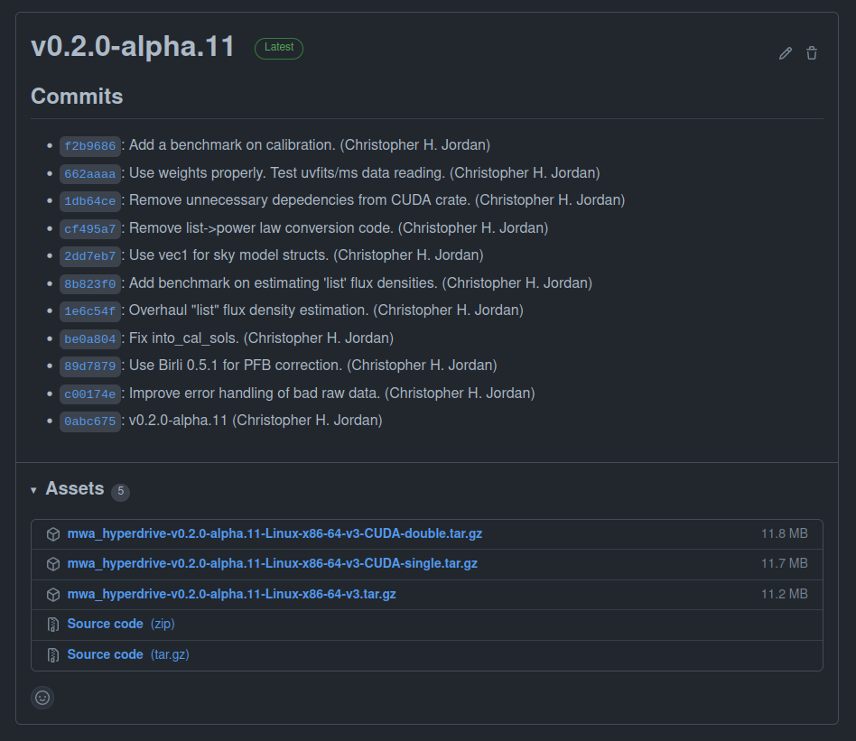

# Installing `hyperdrive` from pre-compiled binaries

Visit the [GitHub releases page](https://github.com/MWATelescope/mwa_hyperdrive/releases). You should see releases like the following:



- Under "Assets", download one of the `tar.gz` files starting with
  `mwa_hyperdrive`;
- Untar it (e.g. `tar -xvf mwa_hyperdrive*.tar.gz`); and
- Run the binary (`./hyperdrive`).

If you intend on running `hyperdrive` on a desktop GPU, then you probably want
the "CUDA-single" release. You can still use the double-precision version on a
desktop GPU, but it will be much slower than single-precision. Instructions to
install CUDA are on [the next page](from_source.md#cuda).

~~~admonish
The pre-compiled binaries are made by GitHub actions using:
```shell
cargo build --release --locked --no-default-features --features=hdf5-static,cfitsio-static
```
This means they cannot plot calibration solutions.
"CUDA-double" binaries have the `cuda` feature and "CUDA-single" binaries have
the `cuda-single` feature. CUDA cannot legally be statically linked so a local
installation of CUDA is required.
~~~
