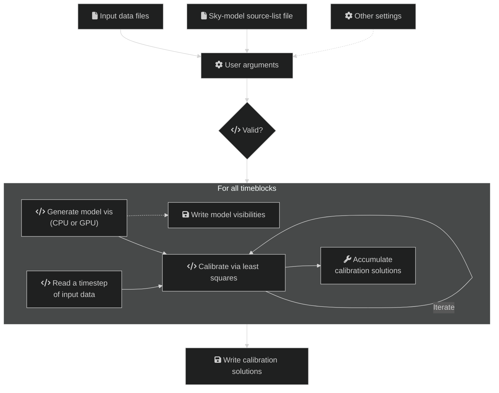

# DI calibration

Direction-Independent (DI) calibration "corrects" raw telescope data.
`hyperdrive` achieves this with "sky model calibration". This can work very
well, but relies on two key assumptions:

- The sky model is an accurate reflection of the input data; and
- The input data are not too contaminated (e.g. by radio-frequency
  interference).

A high-level overview of the steps in `di-calibrate` are below. Solid lines
indicate actions that always happen, dashed lines are optional:

~~~admonish info title="Model visibility outputs"
If `--model-filenames` is supplied, model visibilities are written for inspection.
Auto-correlations are not read by default. Use `--autos` when reading input data to include them. Outputs match the input: if input data includes auto-correlations, they are written; if input data excludes them (default), they are not written.
~~~
