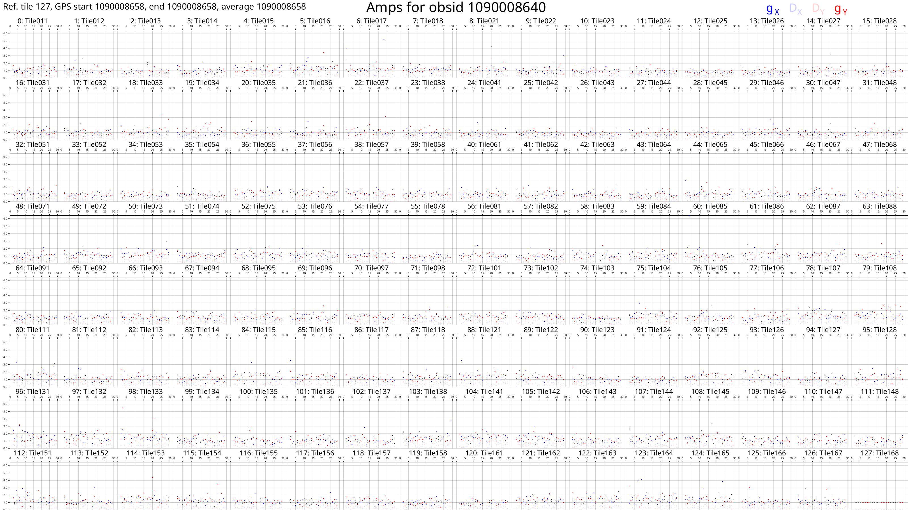
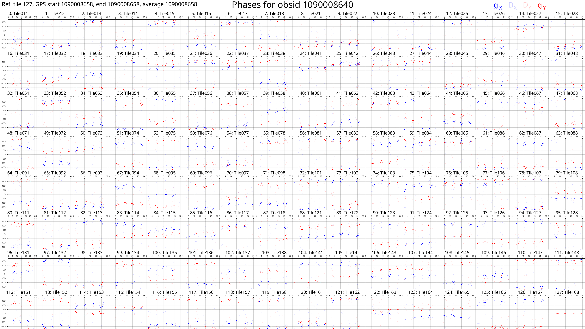
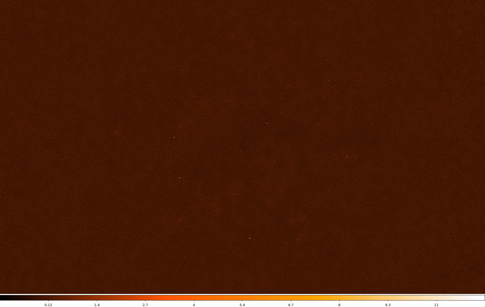
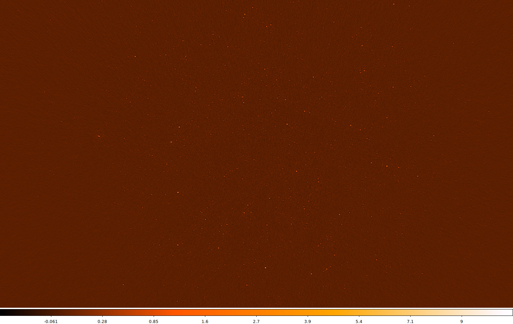

# DI calibration tutorial

Here, a series of steps are laid out to demonstrate how raw MWA data is
calibrated with `hyperdrive`. We also plot calibration solutions and image
calibrated data with `wsclean`.

[Install](../../installation/intro.md) `hyperdrive` if you haven't already.

~~~admonish example title="Step 1: Obtain data"
Feel free to try your own data, but test data is available in the `hyperdrive`
repo; download it with this command:

```shell
git clone https://github.com/MWATelescope/mwa_hyperdrive --depth 1
cd mwa_hyperdrive
```

The files are `test_files/1090008640/1090008640_20140721201027_gpubox01_00.fits`
and `test_files/1090008640/1090008640.metafits`. This is tiny part of the [real
1090008640
observation](http://ws.mwatelescope.org/observation/obs/?obs_id=1090008640) used
in `hyperdrive` tests.
~~~

~~~admonish example title="Step 2: Obtain a suitable sky-model source list"
It's very important to use a sky model that corresponds to the data you're
using. For EoR fields, [srclists](https://github.com/JLBLine/srclists) contains
many suitable source lists.

Here, a source list is already provided for testing:
`test_files/1090008640/srclist_pumav3_EoR0aegean_EoR1pietro+ForA_1090008640_100.yaml`.
~~~

~~~admonish example title="Step 3: Run"
We're going to run the `di-calibrate` subcommand of `hyperdrive`. If you look at
the help (with `hyperdrive di-calibrate --help`), you should see the `--data`
(`-d` for short) and `--source-list` (`-s` for short) flags under an `INPUT
FILES` header. These are the only two things needed to do calibration:

```shell
hyperdrive di-calibrate -d test_files/1090008640/1090008640_20140721201027_gpubox01_00.fits test_files/1090008640/1090008640.metafits -s test_files/1090008640/srclist_pumav3_EoR0aegean_EoR1pietro+ForA_1090008640_100.yaml
```
~~~

~~~admonish tip
The above command can be more neatly expressed as:
```shell
hyperdrive di-calibrate \
    -d test_files/1090008640/1090008640_20140721201027_gpubox01_00.fits \
       test_files/1090008640/1090008640.metafits \
    -s test_files/1090008640/srclist_pumav3_EoR0aegean_EoR1pietro+ForA_1090008640_100.yaml
```
This isn't specific to `hyperdrive`; this is just telling your shell to use
multiple lines separated by `\`.
~~~

~~~admonish example title="Step 4: Understanding the output"
The command we ran in step 3 should give us information on the input data, the
sky model, any output files, as well as things relating to calibration. One line reports:

```plaintext
Reading input data and sky modelling
```

This indicates that `hyperdrive` is reading the data from disk and generating
model visibilities. This is usually the slowest part of the whole process, so
depending on your inputs, this could take some time. You should also see some
progress bars related to these two tasks.

Once the progress bars are finished, calibration can begin. You should see many lines like:

```plaintext
Chanblock  11: converged (50): 1e-4 > 9.57140e-7 > 1e-8
```

This indicates three things:
- Chanblock 11 converged;
- 50 iterations were performed; and
- The final error was 9.57140e-7, which is between 1e-4 and 1e-8.
~~~

~~~admonish info title="What do these things mean?"
A ["chanblock"](../../defs/blocks.md) is a frequency unit of calibration;
it may correspond to one or many channels of the input data.

Calibration is done iteratively; it iterates until the "stop threshold" is
reached, or up to a set number of times. The "stop" and "minimum" thresholds
are used during convergence. If the stop threshold is reached before the maximum
number of iterations, we say that the chanblock has converged well enough that
we can stop iterating. However, if we reach the maximum number of iterations,
one of two things happens:

- The chanblock convergence has not reached the stop threshold but exceed the
  minimum threshold.
  - In this case, we say the chanblock converged and note that it didn't reach
    the stop threshold.
- The chanblock convergence has not reached either the stop or minimum (1e-4
  by default) thresholds.
  - In this case, we say the chanblock did not converge ("failed").

All of these calibration parameters (maximum iterations, stop threshold,
minimum threshold) are allowed to be adjusted.
~~~

~~~admonish example title="Step 5: Analyse"
Don't assume that things will always work! A good indicator of how calibration
went is given toward the end of the output of `di-calibrate`:

```plaintext
All timesteps: 27/27 (100%) chanblocks converged
```

In this case, all chanblocks converged, giving us confidence that things went
OK. But there are other things we can do to inspect calibration quality; good
examples are plotting the solutions, and imaging the calibrated data.
~~~

~~~admonish example title="Plotting solutions"
First, we need to know where the solutions were written; this is also reported
toward the end of the output of `di-calibrate`:

```plaintext
INFO  Calibration solutions written to hyperdrive_solutions.fits
```

So the solutions are at `hyperdrive_solutions.fits`. We can make plots with `solutions-plot`; i.e.

```shell
hyperdrive solutions-plot hyperdrive_solutions.fits
```

The command should give output like this:

```plaintext
INFO  Wrote ["hyperdrive_solutions_amps.png", "hyperdrive_solutions_phases.png"]
```

These plots should look something like this:




Each box corresponds to an MWA tile and each tile has dots plotted for each
channel we calibrated. The dots are really hard to see because there are only 27
channels with solutions. However, if we look _very_ closely, we can see that,
generally, the dot values don't change much with frequency (particularly for the
amps), or the dot values change steadily with frequency (particularly for the
phases). This also hints that the calibration solutions are good.
~~~

~~~admonish info
The solutions plots for the full 1090008640 observation look like this:


Things are much easier to see when there are more dots! As before, changes
with frequency are small or smooth.

More information on the calibration solutions file formats can be seen
[here](../../defs/cal_sols.md).
~~~

~~~admonish example title="Imaging calibrated data"
We have calibration solutions, but not calibrated data. We need to "apply" the
solutions to data to calibrate them:

```shell
hyperdrive solutions-apply \
    -d test_files/1090008640/1090008640_20140721201027_gpubox01_00.fits \
       test_files/1090008640/1090008640.metafits \
    -s hyperdrive_solutions.fits \
    -o hyp_cal.ms
```

This will write calibrated visibilities to `hyp_cal.ms`. Now we can image the
measurement set with [`wsclean`](https://gitlab.com/aroffringa/wsclean):

```shell
wsclean -size 4096 4096 -scale 40asec -niter 1000 -auto-threshold 3 hyp_cal.ms
```

This writes an image file to `wsclean-image.fits`. You can use many FITS file
viewers to inspect the image, but here's what it looks like with
[DS9](https://sites.google.com/cfa.harvard.edu/saoimageds9):



Sources are visible! Generally the image quality is OK, but not great. This is
because there was very little input data.
~~~

~~~admonish info
When using the [full 1090008640
observation](http://ws.mwatelescope.org/observation/obs/?obs_id=1090008640),
this is what the same image looks like (note that unlike the above image, "sqrt"
scaling is used):



Many more sources are visible, and the noise is much lower. Depending on your
science case, these visibilities might be "science ready".
~~~
