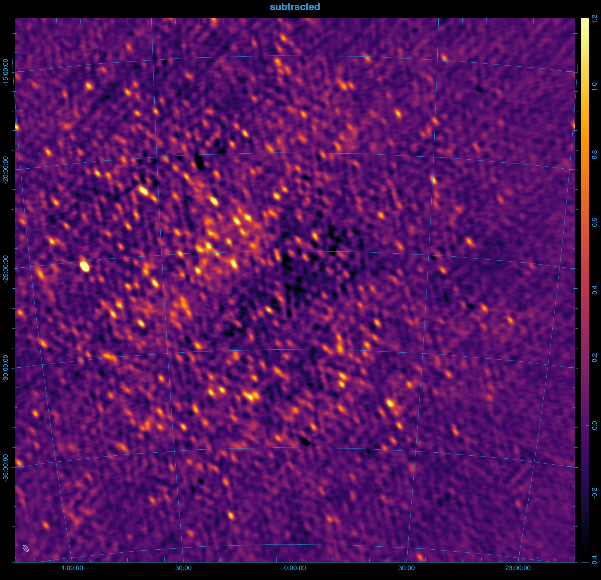
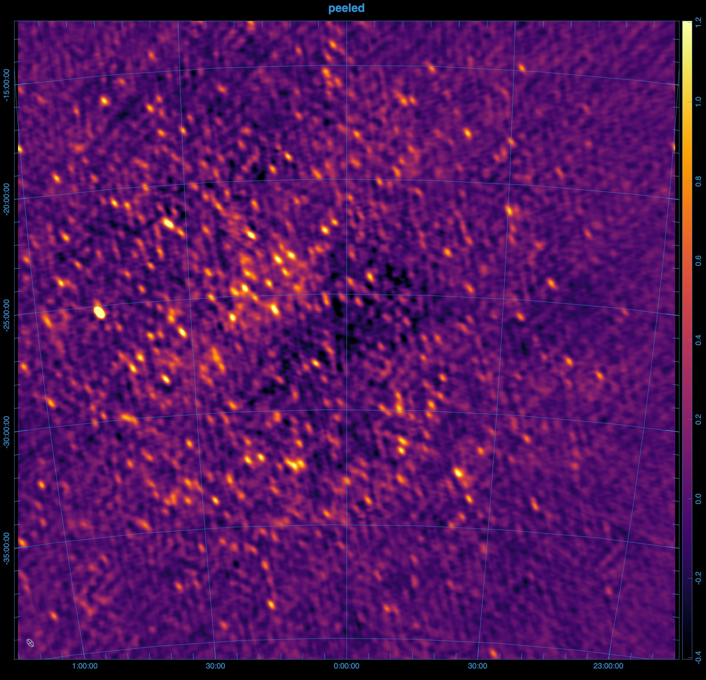

# Peel visibilities

`peel` can subtract the sky-model visibilities from calibrated data visibilities, and write them out like [vis-subtract](../vis_subtract/intro.md), but it additionally solves for and applies the direction dependent effects of the ionosphere.

~~~admonish warning title="Work in progress"
Hyperdrive's `peel` implementation technically only performs ionospheric subtraction. For more on the distinction between the two, read on. Familiarity with the `vis-subtract` command is recommended.
~~~

~~~admonish tip title="Autos"
Outputs include auto-correlations by default when present. Add `--output-no-autos` to write crosses-only.
~~~

## Example

From the images below, it's clear that peeling 100 sources, rather than directly subtracting them
results in a much cleaner image.





<details>
<summary>Steps to reproduce the images above.</summary>

The images above were generated using mwa-demo with the following `demo/00_env.sh`

```bash
export obsid=1321103688

# preprocessing
export freqres_khz=40
export timeres_s=2
# calibration: only use the 11th timestep from the raw files
export apply_args="--timesteps 10"
export dical_name="_t10"

# peeling
export num_sources=100
export iono_sources=100
export num_passes=1
export num_loops=1
export freq_average=80kHz
export time_average=8s
export iono_freq_average=1280kHz
export iono_time_average=8s
export uvw_min=50lambda
export uvw_max=300lambda
export short_baseline_sigma=40
export convergence=0.9

# imaging
export briggs=0.5
export size=8000
export scale=0.0035502
export niter=10000000
export nmiter=5
export wsclean_args="-multiscale-gain 0.15 -join-channels -channels-out 4 -save-source-list -fit-spectral-pol 2"

# generate the peeled visibilities
demo/09_peel.sh

# generate the subtracted visibilities
export iono_sources=0
export peel_prefix="sub_"
demo/09_peel.sh

# image everything
demo/07_img.sh
```

</details>

## Ionospheric subtraction

Light travels slower through regions of higher electron density, especially at lower frequencies. When light from a source passes through the ionosphere, it is refracted, causing a shift in the apparent position and brightness of the source. This shift varies with the direction of the source and can change over time.

Assuming the ionosphere is a thin screen with a slowly varying electron density, the direction and magnitude of the shift depend on the gradient of the electron density along the line of sight and scale with the square of the light's wavelength.

Ionospheric subtraction models the effect of the ionosphere on a given source using three parameters:

- The ionospheric offset vector (α, β), which is a constant of proportionality in front of λ², representing the shift in the source's apparent position in image space (l, m), such that l = αλ², m = βλ².
- A gain (g), which captures any changes in the apparent brightness of the source.

Hyperdrive solves for these ionospheric parameters for each source using the algorithm described in [Mitchell 2008](https://ieeexplore.ieee.org/document/4703504) one timeblock at a time.

### Algorithm

The starting point (and end point) for ionospheric subtraction is the residual visibilities, which is the calibrated data with the ionospheric sky model subtracted. Initially, the ionospheric parameters of each source are not known, and so the sources are subtracted without any ionospheric corrections, but the solutions are usually improved in subsequent passes.

Looping over each source, the residuals are phased to the source's catalogue position, and the model for the source that was subtracted is added back in to the data. Let's call these visibilities the

First, all other sources in the sky-model are subtracted from the calibrated data, and the data is phased to the catalogue position of the source. The data can then be averaged to a lower resolution to improve performance. Finally, the ionospheric parameters are measured using the least-squares fit described in the paper.

## Loop parameters

In reality, the ionosphere is a complex, turbulent medium, and not all tiles see the same ionosphere so the algorithm includes several safeguards to prevent divergent solutions. Each source's offsets are calculated in a loop, with a convergence factor to reduce the step size as the solution approaches the correct value.

In the first pass of the algorithm, the ionospheric offsets are not known, and so the sources are not necessarily subtracted from their correct positions, but the solutions are usually improved in subsequent passes.

`--num-loops` sets the maximum number of loops for each source, while `--num-passes` is the number of passes over all sources. Decreasing `--convergence` is one way to improve the quality of the solutions, but it will also increase the runtime.

## Averaging

hyperdrive reasons about visibilities at multiple resolutions:

- The input data's original resolution
- The input data's resolution during reading ( `--time-average`, `--freq-average` )
- The resolution of the ionospheric subtraction ( `--iono-time-average`, `--iono-freq-average` )
- The resolution of the output visibilities ( `--output-vis-time-average`, `--output-vis-freq-average` )

All of these resolutions are specified in seconds or Hz, and are multiples of the input data's resolution. If the resolution is 0, then all data are averaged together.

## Weighting

It is important to down-weight short baselines if your point-source sky model is missing diffuse information. The minimum uv-distance to include in the fit can be set with `--uvw-min`, and the maximum with `--uvw-max`. The default is to include all baselines > 50λ.

hyperdrive also borrows from RTS, which used a gaussian weighting scheme to taper short baselines, `1-exp(-(u²+v²)/(2*σ²))`, where `σ` is the tapering parameter. This can be set with `--short-baseline-sigma`, and defaults to 40λ.

## Source Counts

Similar to [`vis-subtract`](../vis_subtract/intro.md), the total number of sources in the sky model to be subtracted is limited by `--num-sources`, but only the top `--iono-sub` brightest have their ionospheric constants measured and modeled during subtraction. By default, hyperdrive will include sources in the sky model after [vetoing](../vis_simulate/intro.md#vetoing) if `--num-sources` is not specified, and will ionospherically subtract all of these sources if `--iono-sub` is not specified. An error will occur if `--num-sources` is greater than the number of sources in the sky model.

Future versions of peel will include a `--peel` argument to specify the number of sources to peel.

## High level overview

~~~mermaid
%%{init: {'theme':'dark', 'themeVariables': {'fontsize': 20}}}%%
flowchart TD
    InputData[fa:fa-file Calibrated input data]-->Args
    CalSols[fa:fa-file Sky-model source-list file]-->Args
    Settings[fa:fa-cog Other settings]-.->Args

    Args[fa:fa-cog User arguments]-->Valid{fa:fa-code Valid?}
    Valid --> peel

    subgraph peel[For all timesteps]
        Read["fa:fa-code Read a timestep
        of input data"]
        IonoConsts["fa:fa-cog Ionospheric consts
        α, β, g
        per-source, initially unknown"]
        Residual["fa:fa-code Subtract for Residual"]
        Model["fa:fa-code Generate
        ionospheric model vis"]
        IonoConsts --> Model
        Read -------> Residual
        Model --> Residual
        Residual --> Loop
        IonoConsts --> Loop
        subgraph Loop[For each source]
            Phased["fa:fa-code Phase residual to source"]
            SourceModel["fa:fa-code model source"]
            SourceModel & Phased --> Average["fa:fa-code Add source and average data"]
            SourceModel & Average --> Fit["fa:fa-code Fit ionospheric
            model"]
        end
        Fit --> IonoConsts
        Residual --> Write["fa:fa-save Write timeblock
        visibilities"]
    end
~~~

## Peeling

A full peel involves performing direction-independent calibration towards each source, this is currently a work in progress and not yet implemented.
