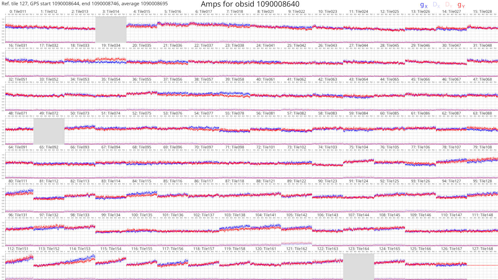
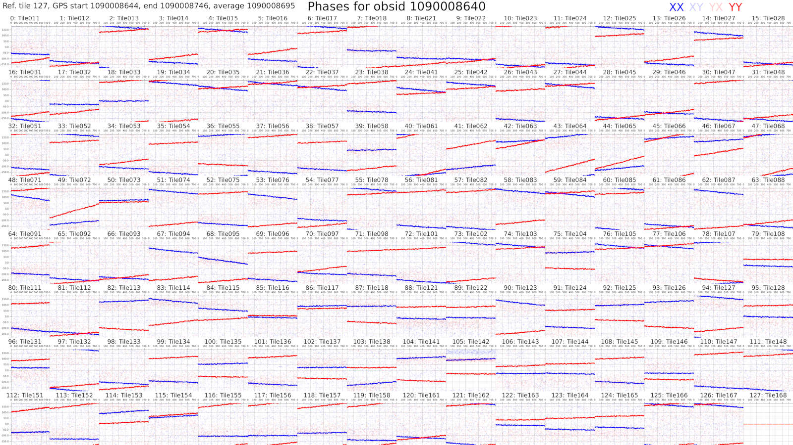

# Plot solutions

~~~admonish danger title="Availability"
Plotting calibration solutions is *not* available for GitHub-built releases of
`hyperdrive`. `hyperdrive` must be built with the `plotting` `cargo` feature;
see the [installation from source instructions
here](../installation/from_source.md).
~~~

`hyperdrive` is capable of producing plots of calibration solutions for any of
its [supported file formats](../defs/cal_sols.md). Note that only
`hyperdrive`-formatted calibration solutions can contain tile names; when tile
names are unavailable, they won't be on the plots *unless* a corresponding
metafits file is provided. With or without tile names, an index is provided.

By default, a reference tile is selected and reported at the top left of the
plot. (By default, the last tile that isn't comprised of only NaNs is selected,
but this can be manually chosen.) It is also possible to neglect using any
reference tile. With a reference tile, each tile's solutions are divided by the
reference's solutions, and the resulting Jones matrix values are plotted (the
legend is indicated at the top right of each plot).

By default, the y-axis of amplitude plots capture the entire range of values.
These plots can therefore be skewed by bad tiles; it is possible to control the
range by specifying `--max-amp` and `--min-amp`.

If a calibration solutions file contains multiple timeblocks, plots are produced
for each timeblock. Timeblock information is given at the top left, if
available.

## Example plots

### Amplitudes ("amps")

### Phases

