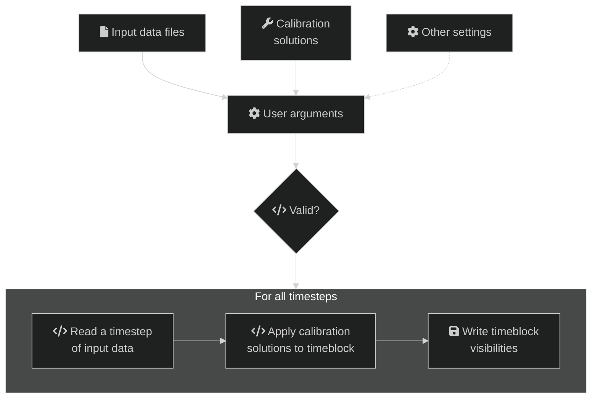

# Solutions apply

`solutions-apply` takes calibration solutions and applies them to input
visibilities before writing out visibilities. All input formats are supported,
however `hyperdrive`-style calibration solutions are preferred because they are
unambiguous when applying multiple timeblocks.

`apply-solutions` can be used instead of `solutions-apply`.

A high-level overview of the steps in `solutions-apply` are below. Solid lines
indicate actions that always happen, dashed lines are optional:

