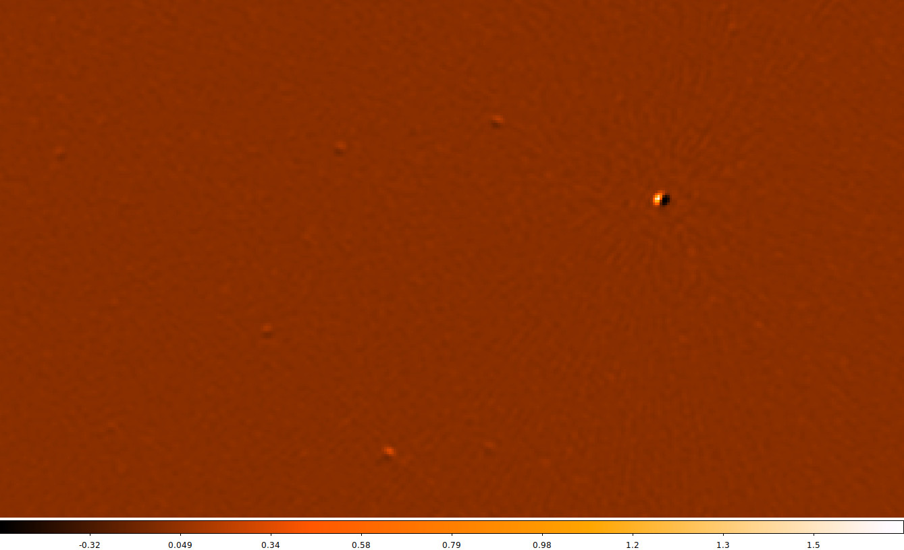
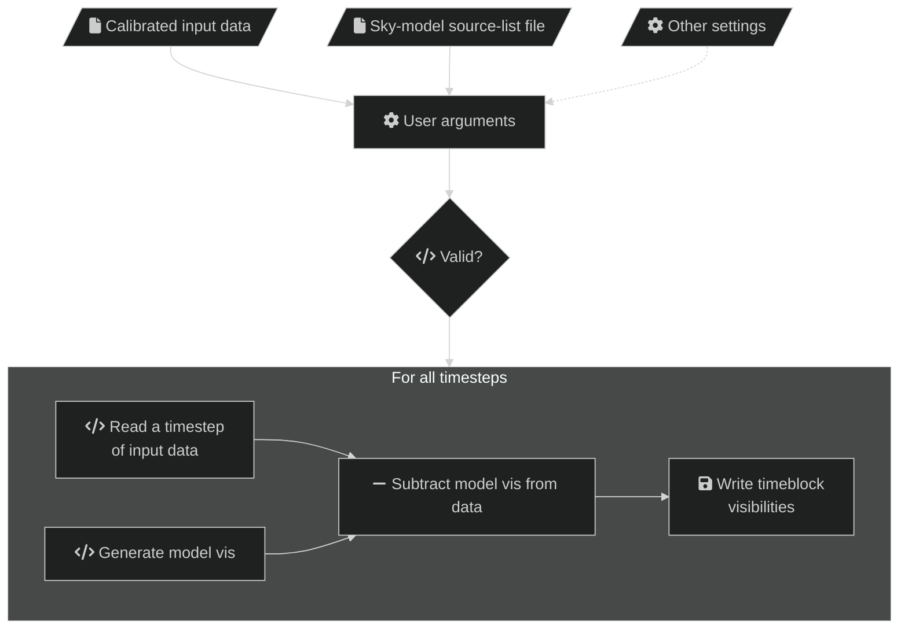

# Subtract visibilities

`vis-subtract` can subtract the sky-model visibilities from calibrated data
visibilities and write them out. This can be useful to see how well the sky
model agrees with the input data, although direction-dependent effects (e.g. the
ionosphere) may be present and produce "holes" in the visibilities, e.g.:

A high-level overview of the steps in `vis-subtract` are below. Solid lines
indicate actions that always happen, dashed lines are optional:

